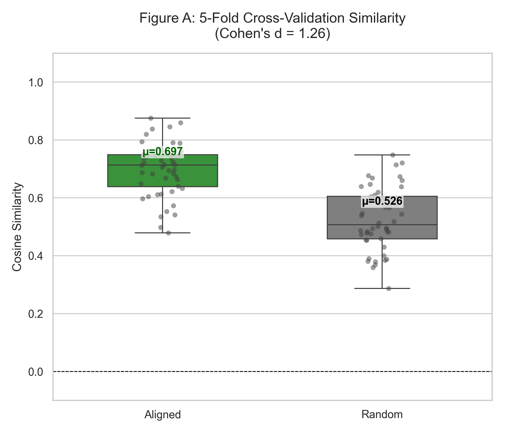
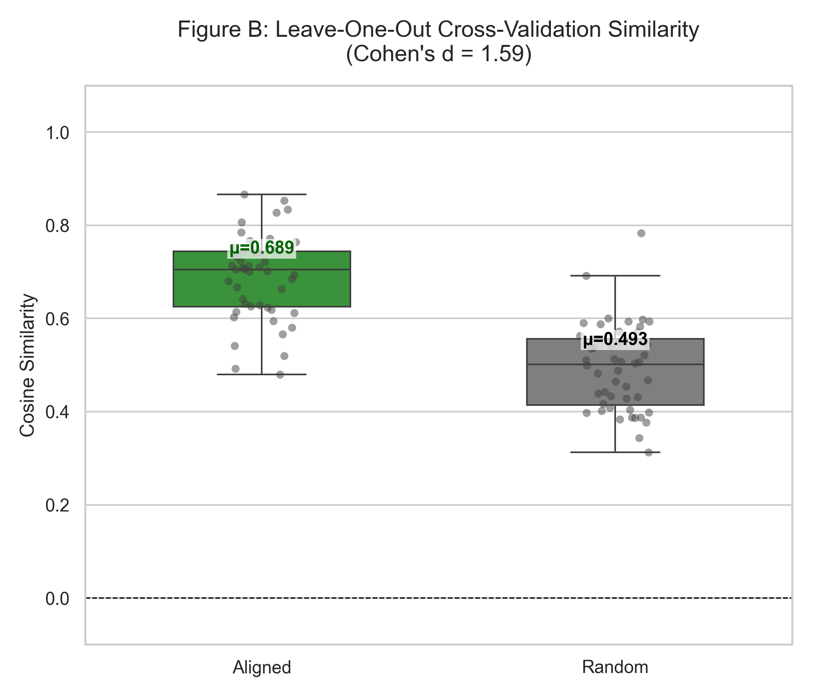

# Yoga–Neuroscience Ontological Alignment

A computational framework for aligning classical yogic cognitive constructs from Patañjali's Yoga Sūtras with contemporary neuroscience concepts using domain-adaptive pretraining (DAPT) and contrastive embedding alignment.

## Overview

This project implements a reproducible two-stage training pipeline to create semantically structured cross-domain embeddings between Yogic psychology and modern neuroscience.

The training process consists of:

1. **Domain-Adaptive Pre-Training (DAPT)** on a combined corpus of:
   - 195 Yoga Sutras (Bryant, 2009 translation)
   - 244 curated neuroscience abstracts

2. **Contrastive Alignment Training** using 48 manually curated yoga–neuroscience concept pairs.

The aligned model achieves a mean cosine similarity of **0.697** on unseen test data (5-Fold Cross-Validation), demonstrating a robust and generalizable alignment. The discriminative margin between aligned and random pairs shows a large effect size (|d| = 1.26 – 1.59), confirming significant structural correspondence without overfitting.

This system enables quantitative investigation of structural correspondences between contemplative cognitive frameworks and neuroscientific constructs.

## Problem Statement

Classical Yogic psychology and modern neuroscience describe attention, selfhood, mental regulation, and cognition using fundamentally different conceptual vocabularies.

Despite conceptual overlaps, there exists no computational framework capable of systematically aligning constructs across these traditions in a measurable and reproducible manner.

This project proposes an AI-assisted ontological alignment system that:

- Learns domain-specific representations via DAPT
- Explicitly trains structural correspondences using contrastive learning
- Quantifies alignment quality using similarity margins and statistical testing
- Visualizes geometric embedding convergence

**The goal is not to assert ontological equivalence between traditions**, but to computationally surface structured correspondences in embedding space.

## Method Summary

### Stage 1 — Domain-Adaptive Pretraining (DAPT)

The base sentence-transformer model is further trained on a combined yoga–neuroscience corpus to adapt embeddings to domain-specific terminology.

### Stage 2 — Contrastive Alignment Training

48 curated concept pairs (e.g., *citta-vṛtti-nirodha* ↔ "executive inhibitory control") are used to train discriminative alignment through cosine similarity optimization.

To ensure robustness and avoid overfitting, the model is evaluated using:
1. **5-Fold Cross-Validation**: Training on 80% of pairs, testing on 20%.
2. **Leave-One-Out Cross-Validation (LOO)**: Training on N-1 pairs, testing on the single held-out pair.

### Evaluation

Alignment quality is measured using:

- **Generalization Ability**: Performance on unseen test pairs.
- **Cohen's d**: Effect size difference between aligned and random pairs.
- **Statistical Significance**: Paired t-tests.
- **Geometric Visualization**: UMAP projection of the aligned space.

## Results Summary

To effectively evaluate generalization and rule out overfitting, we employed stringent cross-validation protocols.

| Evaluation Method | Aligned Similarity | Random Similarity | Effect Size (Cohen's d) |
|-------------------|-------------------|-------------------|-------------------------|
| **5-Fold Cross-Validation** | 0.697 | 0.526 | **1.26** (Large) |
| **Leave-One-Out (LOO)** | 0.689 | 0.493 | **1.59** (Very Large) |

**Key Findings:**
- The model maintains high alignment similarity (~0.70) even on **unseen test pairs** during cross-validation.
- The difference between aligned and random pairs is statistically significant ($p < 10^{-9}$), confirming that the model has learned structural semantic correspondences rather than memorizing training data.
- The effect sizes (1.26 – 1.59) indicate a robust and generalizable alignment between Yoga and Neuroscience concepts.

### Visual Validation
Confusion between true and random pairs is minimal, as shown in the cross-validation distributions:


*(Figure A: 5-Fold CV Alignment Distribution)*


*(Figure B: Leave-One-Out CV Alignment Distribution)*

### Interpretation Note

The alignment margin metric measures the difference between similarity of curated yoga–neuroscience concept pairs and randomly paired cross-domain concepts.

- An increase in margin reflects improved discriminative organization of the embedding space.
- **It does not imply ontological equivalence between traditions.**

## Reproducibility Instructions

### Option 1 — Docker (Recommended)

```bash
git clone https://github.com/yourusername/yoga_neuro_alignment.git
cd yoga_neuro_alignment

# Build and run container (GPU-enabled)
docker-compose up -d
docker-compose exec yoga-neuro-alignment /bin/bash

# Inside container
./scripts/run_full_pipeline.sh
```

See [DOCKER.md](DOCKER.md) for detailed Docker instructions.

### Option 2 — Manual Setup

```bash
git clone https://github.com/yourusername/yoga_neuro_alignment.git
cd yoga_neuro_alignment

python -m venv .venv
source .venv/bin/activate   # Windows: .venv\Scripts\activate

pip install -r requirements.txt

# Run full pipeline
./scripts/run_full_pipeline.sh       # Linux/Mac/Git Bash
.\scripts\run_full_pipeline.ps1      # Windows PowerShell
```

### Option 3 — Reproduce Evaluation Only

```bash
./scripts/reproduce_results.sh       # Linux/Mac/Git Bash
.\scripts\reproduce_results.ps1      # Windows PowerShell
```

### Pipeline Steps

1. `training/run_dapt.py`
2. `training/run_alignment.py`
3. `training/statistical_evaluation.py`
4. `training/visualize_embeddings.py`

Results are stored in:
- `experiments/results/`
- `paper/figures/`

## Data Availability Statement

### Included

- **48 curated alignment pairs** (`data/processed/alignment_pairs.json`)
- **Neuroscience abstracts corpus** (citation-preserving)

### Not Included

**Full text of Edwin F. Bryant (2009), *The Yoga Sūtras of Patañjali*, North Point Press**

Due to copyright restrictions, the full translation and commentary are not redistributed.

Researchers must obtain lawful access to Bryant (2009) to regenerate the yoga corpus.

## Hardware Used

- **NVIDIA RTX 4050 Laptop GPU** (6GB VRAM)
- Mixed precision (FP16)
- Approximate training time:
  - DAPT: ~30 minutes
  - Alignment: ~15 minutes

Pipeline also supports CPU execution.

## Project Structure

```
yoga_neuro_alignment/
├── data/
│   ├── raw/                          # Source data
│   │   ├── bryant_2009.txt          # (not included)
│   │   └── neuro_corpus.csv         # Neuroscience abstracts
│   └── processed/                    # Generated corpora
│       ├── alignment_pairs.json     # 48 concept pairs
│       ├── yoga_corpus.json
│       ├── yoga_corpus_chunked.json
│       └── final_dapt_corpus.json
│
├── experiments/
│   ├── configs/                      # Training configs
│   │   ├── dapt_config.yaml
│   │   └── alignment_config.yaml
│   ├── results/                      # Evaluation outputs
│   │   ├── summary_table.csv
│   │   └── statistical_tests.json
│   ├── logs/                         # Training logs
│   └── metadata.json
│
├── models/
│   ├── e5-yoga-neuro-dapt/          # DAPT checkpoint
│   └── e5-yoga-neuro-aligned/       # Final model
│
├── training/                         # Scripts
│   ├── run_dapt.py
│   ├── run_alignment.py
│   ├── statistical_evaluation.py
│   └── visualize_embeddings.py
│
├── scripts/                          # Reproduction scripts
│   ├── run_full_pipeline.sh
│   └── reproduce_results.sh
│
└── paper/
    └── figures/                      # Visualizations
        ├── base_umap.png
        ├── dapt_umap.png
        ├── aligned_umap.png
        ├── margin_distribution.png
        └── effect_size_plot.png
```

## Authors

Ashmit Singh  
Anvesha Rathee  
Chitjeet Singh  
Gurkirat Singh  
Gurleen Kaur  
Prof. (Dr.) Raghav Mehra

## Citation

If used in research:

```bibtex
@misc{singh2026yoganeuro,
  title        = {Computational Ontological Alignment of Yogic Psychology and Neuroscience},
  author       = {Ashmit Singh and Anvesha Rathee and Chitjeet Singh and Gurkirat Singh and Gurleen Kaur and Raghav Mehra},
  year         = {2026},
  month        = {February},
  howpublished = {\url{https://github.com/ashmitsinghk/yoga_neuro_alignment}},
  note         = {Version 1.0}
}

```

## License

This project is licensed under the MIT License. See LICENSE file for details.

## Contact

[ashmit.singh.k@gmail.com]
